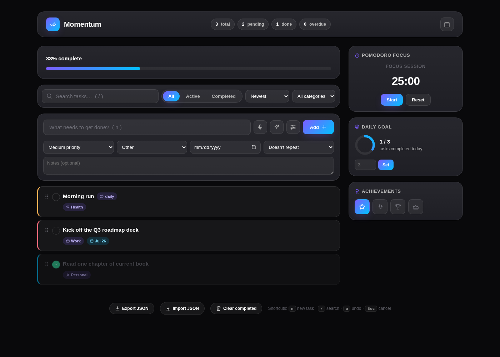

# Momentum

A premium, glassmorphic task manager focused on daily execution — priorities, categories, a calendar view, a pomodoro timer, daily goals, and achievements, all in a single fast, dependency-free interface.



Built with vanilla HTML, CSS, and JavaScript (ES modules). No framework, no build step, no external UI library — every icon is a hand-authored inline SVG, so there's nothing to fetch and nothing to break.

## Features

- **Task management** — add, edit in place (double-click), complete, delete with undo, and recurring tasks (daily / weekly)
- **Priorities & categories** — high / medium / low priority with color-coded borders, five categories (Work, Personal, Study, Health, Other)
- **Search, filter & sort** — instant search, All / Active / Completed tabs, sort by newest, oldest, alphabetical, priority, or manual drag-and-drop order
- **Calendar view** — month grid with due-date indicators; select a day to filter the list down to it
- **Pomodoro timer** — 25-minute focus / 5-minute break cycle with toast notifications on transitions
- **Daily goal ring** — set a daily completion target and track it with an animated progress ring
- **Achievements** — unlockable badges for completion milestones
- **Voice input** — dictate a task via the Web Speech API (falls back gracefully if unsupported)
- **Task suggestions** — quick category-aware suggestions to beat a blank input
- **Import / export** — back up or restore your task list as JSON
- **Keyboard shortcuts** — `n` new task, `/` search, `u` undo, `Esc` cancel
- **Persistent** — everything is saved to `localStorage`, with an in-memory fallback so the app never breaks in a sandboxed preview
- **Accessible** — visible focus states, `aria-live` toasts, semantic roles on tabs, and `prefers-reduced-motion` support throughout

## Tech stack

| | |
|---|---|
| Markup | Semantic HTML5 |
| Styling | Modern CSS — custom properties, `backdrop-filter` glassmorphism, an 8px spacing system, no preprocessor |
| Logic | Vanilla JavaScript, native ES modules (no bundler, no framework, no dependencies) |
| Fonts | [Inter](https://fonts.google.com/specimen/Inter) & [Manrope](https://fonts.google.com/specimen/Manrope) via Google Fonts |
| Storage | `localStorage`, with an in-memory fallback |

## Getting started

Because the app is split into ES modules (`<script type="module">`), browsers block module imports over `file://` for security reasons. Serve the folder instead — any static server works:

```bash
git clone https://github.com/<your-username>/momentum.git
cd momentum

# Option A — no install required
npx serve .

# Option B — via the included npm script
npm start
```

Then open the printed local URL (typically `http://localhost:5173` or `http://localhost:3000`).

You can also deploy it directly to **GitHub Pages** (Settings → Pages → deploy from the `main` branch, root folder) since it's a fully static site.

## Project structure

```
momentum/
├── index.html
├── css/
│   ├── tokens.css       # color, spacing, radius, shadow & motion tokens
│   ├── base.css         # reset, typography, scrollbar, ambient background, loader
│   ├── layout.css       # app shell, header, grid, responsive rules
│   └── components.css   # buttons, inputs, task cards, calendar, widgets, toasts
├── js/
│   ├── state.js         # single source of truth + persistence
│   ├── storage.js       # safe localStorage wrapper with in-memory fallback
│   ├── dom.js            # query-selector helpers
│   ├── icons.js          # inline SVG icon set + renderer
│   ├── toast.js           # toast notifications + confetti
│   ├── tasks.js           # list rendering, CRUD, drag-and-drop, add form
│   ├── stats.js           # progress, stats pills, daily goal, achievements
│   ├── calendar.js        # month calendar view
│   ├── features.js        # pomodoro, voice input, task suggestions
│   ├── shortcuts.js       # keyboard shortcuts
│   └── main.js            # app entry point — wires everything together
├── assets/
│   └── screenshot.png
├── package.json
├── LICENSE
└── .gitignore
```

## Design system

| Token | Value |
|---|---|
| Background | `#09090B` |
| Surface | `#111118` |
| Glass | `rgba(255,255,255,0.06)` |
| Border | `rgba(255,255,255,0.10)` |
| Accent | `#7C5CFF` |
| Secondary accent | `#00C2FF` |
| Text | `#FFFFFF` |
| Secondary text | `#B3B3B3` |

Spacing follows an 8px scale (`4 / 8 / 12 / 16 / 24 / 32 / 48 / 64`), and every interactive element has a visible focus ring and a hover micro-interaction. Motion is disabled site-wide for users with `prefers-reduced-motion` set.

## License

MIT — see [LICENSE](LICENSE).
